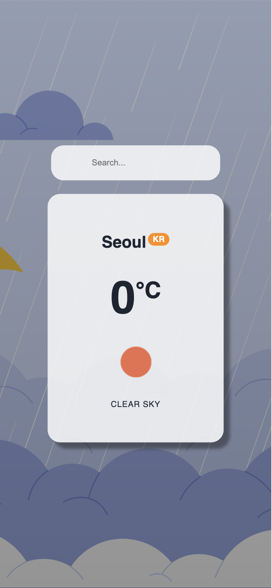

# ⛅️ PWA Weather App made with React

This project was bootstrapped with [Create React App](https://github.com/facebook/create-react-app).

<https://cozy-biscuit-d21b27.netlify.app/>

## About

This is a personal project built in my spare time for learning purposes.

### APIs

* [Free Weather APIs](https://openweathermap.org)

#### Features

* PWA
* Responsive
* Offline ready
* Installable (add to Homescreen )

#### Built with

* React
* VSCode

#### Screenshot

